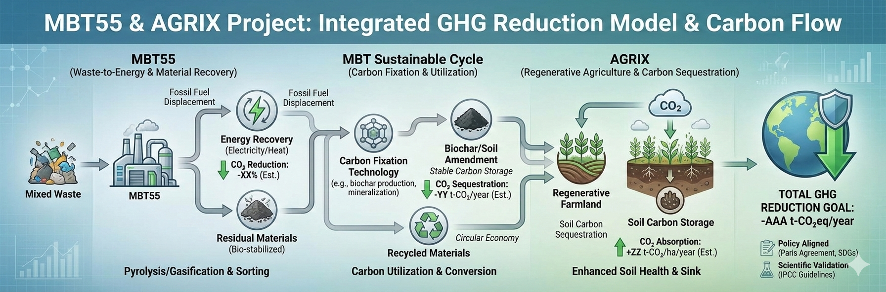

<p align="center">
  
</p>

<h1 align="center">🌍 PMOS</h1>
<h3 align="center">PBPE × MBT55 Investment Engine</h3>

<p align="center">
  Regenerative Agriculture × Carbon Markets × Token Economy
</p>


# 🌍 Planetary Metabolic Operating System (PMOS)
## PBPE × MBT55 Investment Engine

---

## 1. Overview

PMOS is a next-generation investment and simulation engine that integrates:

- Regenerative Agriculture (AGRIX)
- Soil Microbial Science (MBT55)
- Carbon Credit Markets (MRV-ready)
- Token Economy (PBPE)
- Azure Digital Twin (Soil / Crop / Carbon)

---

## 2. Core Thesis

> Agriculture is no longer a commodity business.  
> It is a **biological + carbon + financial asset class**.

---

## 3. Key Features

- MBT55 ON/OFF simulation
- Yield / Cost / CO2 dynamic modeling
- Carbon pricing integration
- IRR / Payback calculation
- LCOA (Levelized Cost of Agriculture)
- PBPE token price simulation
- Investment signal generation

---

## 4. Innovation

### 🔹 Negative Green Premium
Sustainable agriculture becomes cheaper than conventional:

- Yield ↑
- Cost ↓
- Carbon revenue ↑

---

### 🔹 PBPE Tokenization

> "Food production = Carbon asset generation"

---

## 5. Financial Model

### IRR Model
- Multi-layer cash flow:
  - Crop revenue
  - Carbon revenue
  - Token revenue
- Discounted cash flow (WACC)

### LCOA Model
- Cost competitiveness indicator
- Includes carbon & token offsets

---

## 6. PBPE Token Model

PBPE price is derived from:

- Carbon value
- Food production value
- Market demand/supply

---

## 7. System Architecture

```

[Soil Biology]  
↓  
[MBT55 Engine]  
↓  
[Yield / Carbon Simulation]  
↓  
[PBPE Tokenization]  
↓  
[Financial Engine (IRR / LCOA)]  
↓  
[Investment Decision]


---

## 8. Azure Integration Vision

- Azure Digital Twins (Soil / Crop)
- Real-time MRV (Carbon)
- AI-driven prescription (AgriWare)
- Global-scale deployment

---

## 9. Example Output

| Metric | Value |
|------|------|
| Yield | +25% |
| Cost | -30% |
| CO2 | -50% |
| IRR | 28% |
| Payback | 2.8 years |

---

## 10. Installation

```bash
pip install -r requirements.txt
streamlit run app.py
````

---

## 11. Roadmap

### Phase 1

- Basic simulation ✔
    

### Phase 2（Current）

- IRR refinement
    
- LCOA implementation
    
- Carbon MRV
    

### Phase 3

- Token economy model
    
- Country allocation engine
    

### Phase 4

- Azure Digital Twin integration
    

---

## 12. Target Users

- Climate funds
    
- Sovereign wealth funds
    
- Agri-investors
    
- ESG portfolios
    
- Governments
    

---

## 13. License

Proprietary / Strategic Collaboration

---

## 14. Contact

- **Lead Scientist**: Kaz Shimojo - Bionexus Holdings Co-Founder
- **Technical Inquiries**: GitHub Issues
- **Partnerships**: info@terraviss.com
